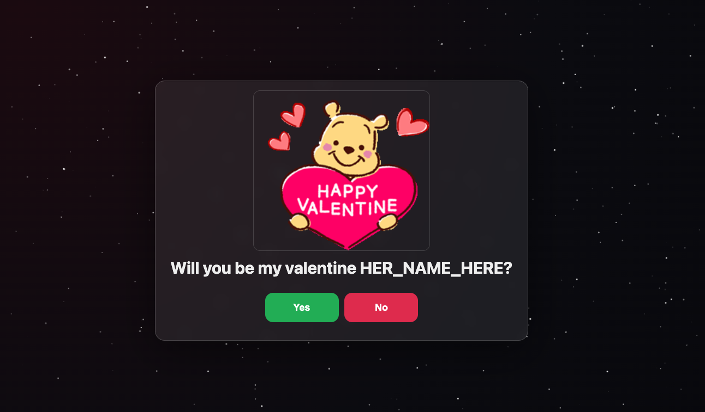

# Valentine website

A meme website made in HTML, for my friend to ask his crush out. What makes this project special is the interactive and engaging way it handles responses.

## Customize Website

Edit: `config/site.config.json` to personalise the messages

- `personal.toName` / `personal.fromName`
- `personal.introLines` (the intro text)
- Choices under `choices.food`, `choices.flowers`, `choices.sweets`

Edit: `assets/*.gif` to personalise the memes

## Saving responses (GitHub issue comment)

This site can submit the answers by creating a comment on a single GitHub issue using the GitHub REST API:

- `POST /repos/{owner}/{repo}/issues/{issue_number}/comments`

Configure in `config/site.config.json` under `github`.

Security note: creating issue comments requires a token. Any token used in a browser is visible to anyone who can load the site. For personal use, use a **fine-grained** token restricted to a single repo with **Issues: write**.

## Music (optional)

The code supports music cues, but it’s off by default.

- Add your own audio files under `assets/` (e.g. `bgm.mp3`, `yes.mp3`, `no.mp3`)
- Update `media.audio.*` in `config/site.config.json`
- Set `media.audio.enabled` to `true`

## Run locally

From repo root:

- `python3 -m http.server 8081`

Then open `http://localhost:8081`.
